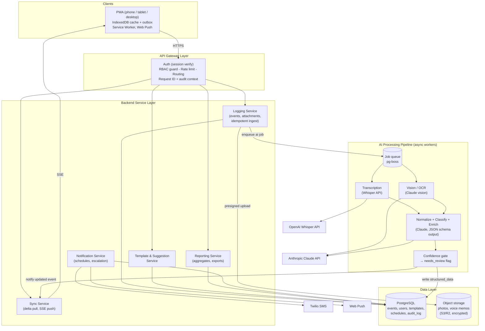
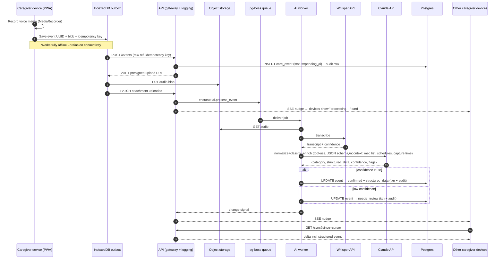
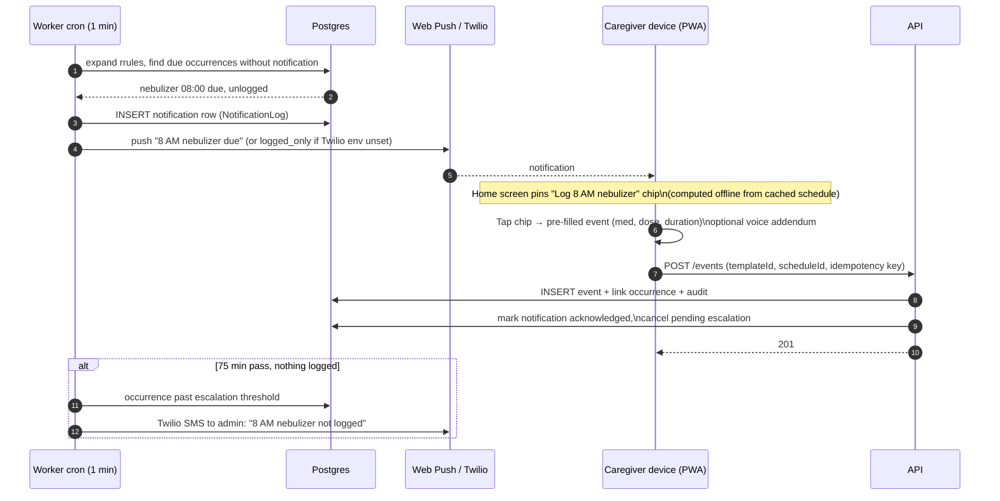

# Caretaker Activity Logging App — Architecture Design ("CareLog")

**Status:** Original design document · 2026-07-04

> **Note:** This is the pre-implementation design document, preserved largely as written.
> A few details have since drifted from the implementation — notably the repo uses
> **Prisma 5 with `prisma-client-js`** (not Prisma 7 driver adapters) and media storage is
> currently a **local-filesystem store** (S3/R2 not yet wired). Where this document and the
> code disagree, the code and the root `CLAUDE.md` are authoritative.
>
> Key decision up front: **greenfield app, not an extension of a prior in-house care app** — that app was explored and confirmed a poor fit (single-admin HMAC auth, no roles, no patient/event model, no PWA/offline). Reuse the author's proven conventions instead: Railway + separate cron/worker service, Prisma driver adapters, Zod at boundaries, strict 3-layer services, Twilio SMS with NotificationLog fallback.

---

## 1. Context & Goals

This system lets a small team of caregivers (family members plus possibly hired help) log the daily care of one senior patient: nebulizer treatments, medications, meals, mood/behavior observations, and miscellaneous notes. Entries arrive as typed text, dictated speech, photos, or voice memos. An AI pipeline turns that messy, multimodal input into clean structured records that feed reminders, adherence tracking, and doctor-visit reports.

**Primary goals**

1. **Zero-friction capture.** A caregiver mid-task has one hand free and ten seconds. Logging a nebulizer treatment must take one tap on a suggested template or one voice memo — never a form with twelve fields.
2. **Trustworthy record.** Every entry is attributable (who, when, from which device), immutable in history (append-only with audit trail), and reviewable when the AI's confidence is low.
3. **Coordination.** All caregivers see the same near-real-time picture; scheduled treatments generate reminders and escalate if nobody logs them.
4. **Reporting.** Medication adherence, mood trends, and event timelines exportable for physician visits.

**Explicit non-goals (v1):** multi-patient SaaS tenancy, EHR/FHIR integration, medical decision support. The schema keeps a `patients` table so multi-patient support is a data change, not a rewrite — but the product is built for one household.

**Greenfield, not an extension of a prior app.** An existing in-house care app was evaluated as a starting point and confirmed a poor fit: it has single-admin HMAC-cookie auth (no user accounts or roles), no patient/care-event domain model, and no PWA/offline infrastructure. Retrofitting multi-user RBAC, an event schema, and offline sync onto it would cost more than a clean start and would destabilize a live app. **Recommendation: a new greenfield app that reuses the author's proven conventions rather than that app's code** — Railway deployment with a separate cron/worker service, Prisma with driver adapters, Zod validation at every boundary, a strict 3-layer service architecture (routes → services → data access), and Twilio SMS with a NotificationLog fallback when env vars are unset.

**Honest sizing note.** The realistic load is ~5 users, ~30–60 events/day, one patient. The document presents the full layered architecture that was requested — gateway, service decomposition, pipeline, scale-out path — but the concrete recommendation throughout is a **modular monolith with clean internal seams**, deployed on Railway, that can be split into the microservice shape later if it ever needs to. Every "service" in Section 5 is designed as a module boundary first and a deployment boundary only if warranted. Building the distributed version first would multiply operational cost and failure modes for zero benefit at this scale.

---

## 2. System Overview

Five layers, matching the requested structure:

1. **Clients** — installable PWA (phone + desktop browser), offline-first with a local outbox.
2. **API gateway layer** — TLS termination, auth verification, rate limiting, routing. On the pragmatic path this is middleware inside the app plus Railway's edge; on the scale-out path it's a dedicated gateway.
3. **Backend service layer** — logging, templates/suggestions, notifications, reporting, sync. Business logic only; no AI calls inline in request handlers.
4. **AI processing pipeline** — async workers pulling from a job queue: transcription (audio), vision/OCR (photos), LLM normalization + classification + enrichment (Claude with structured output), confidence gating.
5. **Data layer** — Postgres (system of record, including the job queue via pg-boss), object storage for media, append-only audit log.



The one structural rule that everything else hangs on: **the write path never blocks on AI.** An event is accepted, persisted, and synced immediately with `status = 'pending_ai'` and the raw input intact; the pipeline enriches it asynchronously and pushes the update. This is what makes offline capture, retries, and AI-vendor outages all non-events for the caregiver.

---

## 3. Front-End Architecture

### 3.1 PWA over React Native/Flutter — recommendation and rationale

**Recommendation: an installable Next.js PWA.** Not React Native, not Flutter.

- **Fit for purpose.** Everything this app needs from the device is available to the web platform today: camera (`<input capture>` / `getUserMedia`), microphone (`MediaRecorder`), speech-to-text (Web Speech API where available), offline storage (IndexedDB + Service Worker), and push notifications (Web Push works on iOS since 16.4 for installed PWAs, and everywhere on Android/desktop). There is no native-only capability on the requirements list.
- **Fit for the team.** A solo developer maintaining one Next.js codebase ships features; the same developer maintaining a React Native app plus its build pipeline, app-store review cycle, and a separate web admin ships apologies. The author already runs PWAs on Railway, so the marginal operational knowledge is zero.
- **Distribution.** Family caregivers install from a link — no App Store account, no TestFlight invitations, instant updates on deploy. For a five-person private app this is decisively better.
- **Escape hatch.** If a genuinely native capability ever becomes necessary (e.g., background geofenced reminders), wrap the same web app in Capacitor rather than rewriting. Flutter is the weakest option here: separate language, no code sharing with the web, and its web target is poor for form-heavy apps.

**Stack:** Next.js (App Router) + TypeScript, TanStack Query for server state (with optimistic updates on every mutation — `onMutate`/`onError` rollback/`onSettled`, not onSuccess-only invalidation), Serwist or a hand-rolled Service Worker for precaching and the offline shell, Tailwind + a component library tuned for large tap targets (caregivers may be older adults using phones one-handed).

### 3.2 Offline-first design

The client treats the network as an optimization. Three pieces:

**Local store (IndexedDB, via Dexie).**
- `events` — a local replica of recent care events (last ~60 days), hydrated by delta sync.
- `outbox` — pending mutations created offline or mid-flight. Each outbox record carries a client-generated **event UUID** (which becomes the server primary key — no temporary-ID remapping) and an **idempotency key**, plus the payload and any local blob references.
- `blobs` — captured photos/audio stored locally until uploaded.
- `meta` — sync cursor, session info, cached templates and schedules (so suggestions work offline).

**Outbox drain.** A background loop (triggered on connectivity regain, app focus, and Service Worker `sync` where supported) posts outbox entries in order. The server treats `POST /events` as idempotent on the idempotency key: replays return the original result instead of creating duplicates. Media uploads go through presigned URLs and are retried independently of the event row — an event can sync with `attachment_status = 'uploading'` and complete later.

**Conflict strategy.** Care events are overwhelmingly **append-only**: two caregivers rarely edit the same record, they create separate records. So the strategy is deliberately simple:
- Creates never conflict (client-generated UUIDs).
- Edits use **optimistic versioning**: the client sends the `version` it edited from; on mismatch the server applies **last-write-wins** but records the losing write's before/after in the audit log, and flags the event `has_conflict` so the UI can surface "Alex also edited this entry" for human reconciliation. Given ~5 users, this will fire approximately never — but when it does, nothing is silently lost, because the audit trail retains every version.
- No CRDTs, no operational transforms. That machinery is for collaborative text editing, not append-mostly logs; adopting it here would be pure complexity.

### 3.3 Capture modalities

| Modality | On-device | Server-side | Notes |
|---|---|---|---|
| Text | Plain textarea, autosaved to outbox | — | Always available |
| Speech-to-text (dictation) | **Web Speech API** live transcript where available | Raw audio also recorded and re-transcribed by Whisper | Hybrid, see below |
| Voice memo | `MediaRecorder` → Opus/WebM blob | Whisper API transcription in pipeline | Works fully offline; transcription happens on sync |
| Photo | Camera capture, client-side downscale to ≤2048px + EXIF strip | Claude vision for description/OCR (med labels, food, paper notes) | Downscaling cuts upload size and API cost |

**On-device vs. server speech-to-text — use both, trust the server.** The Web Speech API gives instant feedback, but its quality is inconsistent (especially with medication names) and on some browsers it ships audio to a vendor anyway. So: when dictating, show the live on-device transcript for immediate confirmation, but *also* keep the recorded audio and re-transcribe server-side with Whisper, which handles "albuterol 2.5 mg via nebulizer" far more reliably. The pipeline uses the Whisper transcript as the AI input of record. Offline or where Web Speech is unavailable, the flow degrades gracefully to plain voice memo. This costs pennies (Whisper is ~$0.006/min; this household might generate 20 minutes of audio a day).

### 3.4 Template suggestion UX

The home screen is a **capture bar plus a ranked row of suggestion chips**. Ranking is computed client-side from cached data — it must work offline and feel instant:

1. **Schedule proximity (dominant signal).** If a scheduled activity's window is open or recently missed (e.g., nebulizer due 8:00 AM ± 90 min, not yet logged), its quick-log template pins to slot one: *"Log 8 AM nebulizer treatment"*. One tap creates a pre-filled event (category, med, dose, duration from the schedule) that the caregiver can submit as-is or adjust.
2. **Time-of-day frequency.** Templates historically used in this hour-of-day bucket (meals at mealtimes, mood note in the evening).
3. **Recency/frequency** for everything else.

Server-side, the template service periodically recomputes usage statistics and (later phase) asks Claude to *propose new templates* from recurring free-text patterns — e.g., if "gave her Ensure with lunch" keeps appearing as free text, suggest a "Nutritional supplement" template for the admin to approve. Templates are user-customizable: field defaults, label, icon, category. Selecting a template still allows a free-text/voice addendum, which flows through the same AI pipeline and merges into the structured record.

---

## 4. API Gateway & Auth

### 4.1 Gateway

On the pragmatic path, "gateway" is a **thin edge layer inside the Next.js app**: Railway's edge handles TLS; Next.js middleware handles session verification, role guard, request-ID injection, and rate limiting before any route handler runs. This is functionally the requested gateway — auth, routing, rate limiting — without a second deployable. On the scale-out path (Section 13), these responsibilities lift into a dedicated gateway (AWS API Gateway or Envoy/Traefik) unchanged in *contract*, which is why the middleware is written as a discrete, testable module rather than scattered checks.

- **Rate limiting:** per-user counters (Postgres-backed, or in-memory per instance at this scale — honest answer: with 5 users it's mostly protection against a runaway client retry loop and abuse of the AI endpoints, which are the only expensive ones). AI-triggering endpoints get a stricter budget (e.g., 30 jobs/user/hour).
- **Routing:** REST under `/api/v1/*` — `events`, `templates`, `schedules`, `sync`, `reports`, `admin`. Versioned from day one because offline clients mean old app versions keep talking to new servers. Every request body is parsed through a **Zod schema at the boundary** before any service code runs — an existing convention, applied uniformly.
- **Every request** gets a `request_id` and an authenticated `actor` context that flows into the audit log.

### 4.2 AuthN

**Auth.js (NextAuth) with database sessions.** Note this is a deliberate departure from the prior app, whose single-admin HMAC-cookie auth cannot express multiple users or roles and is exactly why extending it was rejected. Providers: Google sign-in (proven low-friction for non-technical family members in a previous project) plus email magic-link for caregivers without Google accounts. Database-backed sessions (not stateless JWTs) because instant revocation matters when a hired caregiver leaves — you remove their access *now*, not at token expiry. Sessions are long-lived (30 days, rolling) so caregivers aren't re-authenticating at the bedside. Invite-only registration: an admin generates an invite link bound to a role; there is no open signup.

### 4.3 RBAC

Roles are **per patient-assignment**, not global user flags (the `caregiver_assignments` table, Section 7), which keeps the door open to multi-patient later:

| Role | Log events | Edit own | Edit others' | Manage templates/schedules | Manage users | View reports | View audit log |
|---|---|---|---|---|---|---|---|
| `admin` (family coordinator) | ✅ | ✅ | ✅ (audited) | ✅ | ✅ | ✅ | ✅ |
| `caregiver` | ✅ | ✅ (within 24h) | ❌ | propose only | ❌ | ✅ | own actions |
| `viewer` (clinician / remote relative) | ❌ | ❌ | ❌ | ❌ | ❌ | ✅ | ❌ |

Enforcement lives in one place: a `can(actor, action, resource)` policy module invoked by the gateway middleware for coarse checks and by services for row-level checks (e.g., "caregiver may edit only their own events, only within 24 hours"). Never inline role checks in route handlers.

---

## 5. Backend Service Layer

### 5.1 Service decomposition

Five services, defined by responsibility and data ownership:

- **Logging Service** — the write path. Validates (Zod schemas), persists events idempotently, issues presigned upload URLs for attachments, enqueues AI jobs, emits sync notifications. Owns `care_events`, `attachments`.
- **Template & Suggestion Service** — CRUD for templates, usage-stat aggregation, (later) AI-proposed templates. Owns `templates`, usage stats.
- **AI Processing Worker** — consumes the job queue; the entire Section 6 pipeline. Owns no tables; writes back to `care_events` via the logging module's update API (so audit + sync fire uniformly).
- **Notification Service** — evaluates `schedules` on a cron tick, sends push/SMS, tracks acknowledgment, escalates unlogged scheduled care. Owns `schedules`, `notifications`.
- **Reporting Service** — read-only aggregations, adherence/mood computations, PDF/CSV export. Owns materialized views/rollups only.

Cross-cutting: the **Sync Service** (delta reads + SSE fan-out) and the **audit writer** (invoked by every mutation, in the same DB transaction as the change).

### 5.2 Modular-monolith mapping — the actual recommendation

All five services are **TypeScript modules in one repository, one Prisma schema, deployed as two Railway processes** — matching the author's existing web-app-plus-separate-cron-service deployment convention:

```
apps/web        → Next.js app: UI + API routes + gateway middleware + SSE  (Railway service 1)
apps/worker     → pg-boss consumers: AI pipeline + notification cron       (Railway service 2 —
                                                     the "separate cron service" convention)
packages/core   → domain modules: logging/, templates/, notifications/,
                  reporting/, sync/, policy/, audit/
packages/db     → Prisma 7 schema + client (driver adapters, node-postgres)
packages/shared → Zod schemas, category enums, types shared with the client
```

**Inside every module, a strict 3-layer architecture** (the author's established pattern):
1. **Route/controller layer** — HTTP concerns only: Zod-parse the request at the boundary, resolve the actor, call the service, shape the response. No business logic.
2. **Service layer** — business logic, policy checks (`can(...)`), audit writes, transaction orchestration. No HTTP types, no direct Prisma queries.
3. **Data-access layer** — Prisma repositories with typed methods; the only layer that touches the database. Modules never reach into another module's tables — only its service interface.

The web/worker split is the one deployment boundary that pays for itself immediately: AI calls and transcription are slow and bursty, and must not share an event loop with interactive requests. Everything else stays in-process until a concrete pressure (independent scaling, deploy cadence, team growth) forces a split — at which point a module with a typed interface and exclusive table ownership extracts into its own container in days, not months. This discipline — *module boundaries now, network boundaries later* — is the whole trick.

---

## 6. AI Processing Pipeline

### 6.1 Why not TensorFlow/PyTorch

The original brief suggested TensorFlow/PyTorch. **This is the wrong tool class for this problem.** Those are frameworks for *training* models, which presupposes labeled training data (this app starts with zero examples), ML engineering time (solo developer), and GPU serving infrastructure. The actual tasks — turning "gave her the breathing treatment about 20 min ago, she did ok but coughed a lot after" into `{category: nebulizer_treatment, occurred_at: …, duration: …, observations: [coughing_post_treatment]}` — are language understanding and structured extraction, which frontier LLM APIs do out of the box, with few-shot prompting instead of training, for fractions of a cent per event. **Recommendation: Anthropic Claude API** (already proven in a prior project of the author's for exactly this parse-messy-input-to-structured-data pattern). Claude Haiku 4.5 for routine classification/extraction (fast, ~90% of Sonnet capability at a third of the cost), escalating to Sonnet when confidence is low or the input is long/ambiguous — and note from that project's experience that **vision tasks need Sonnet-class models**; don't route photo analysis to Haiku without verifying vision quality first. A custom model would only enter the picture years later, if ever, as a cost optimization distilled *from* accumulated LLM-labeled data.

### 6.2 Pipeline stages

Each stage is an idempotent pg-boss job; a failure retries with exponential backoff (3 attempts, then dead-letter → event flagged `ai_failed`, raw input still fully usable and shown as-is).

```
ingest → (transcribe | vision) → normalize+classify → enrich → confidence gate → store+sync
```

1. **Ingest.** Logging service persists the event with `raw_input`, `status='pending_ai'`, and enqueues `ai.process_event` keyed by event ID (natural idempotency: reprocessing overwrites the same derived fields).
2. **Transcribe (audio).** OpenAI **Whisper API** — best accuracy-to-effort ratio, ~$0.006/min. Alternative: **AssemblyAI** if medical-vocabulary boosting proves necessary; self-hosted `faster-whisper` only if privacy posture later demands no-third-party audio. Transcript stored on the attachment row.
3. **Vision (photos).** **Claude vision** in the same normalize call — image + context in one request. Handles OCR of medication labels, describing a meal photo, reading a paper note from a visiting nurse. No separate OCR service needed at this volume.
4. **Normalize + classify.** One Claude call with **tool-use / structured output**: the tool's input schema *is* the output contract, so responses are guaranteed-parseable JSON. The prompt includes: the transcript/text/image, capture timestamp and template context, the category taxonomy with definitions, the patient's current medication list and schedules (retrieved context — this is what turns "her breathing medicine" into "albuterol 2.5mg"), and 5–10 few-shot examples. Category enum: `nebulizer_treatment | medication | meal | hydration | mood_behavior | vitals | toileting | sleep | activity | incident | observation_other`. Per-category Zod/JSON schemas define the structured payload. The model also returns `confidence: 0–1` and `flags` (e.g., `possible_missed_dose`, `mentions_pain`, `time_ambiguous`).
5. **Enrich.** Mostly within the same call (one round trip, cheaper, more coherent): extract med names/doses/durations, map mood language to a 1–5 mood score with the raw phrase preserved, resolve relative times ("about an hour ago") against capture time, link the event to a matching `schedule` occurrence when one is open (this linkage powers adherence tracking and reminder cancellation).
6. **Confidence gate.** `confidence ≥ 0.8` → `status='confirmed'` (auto-accepted, still editable). `0.5–0.8` → `needs_review`; the *authoring caregiver* gets a gentle in-app prompt showing raw input beside the AI's interpretation with one-tap confirm/fix. `< 0.5` or schema violation → `needs_review` with the structured guess withheld from reports until confirmed. Every human correction is stored (audit log holds AI-version → human-version) — this becomes the few-shot/eval corpus that improves the prompt over time, evaluated with a nightly-eval pattern proven in a prior project.
7. **Store + sync.** Derived fields written in one transaction with an audit entry (`actor = system:ai-pipeline`, model + prompt version recorded), then an SSE nudge fans out so every device refreshes the event from "processing…" to its structured card.

### 6.3 Queue choice: pg-boss

**pg-boss.** It runs on the Postgres already being paid for — no Redis (BullMQ's requirement), no AWS plumbing (SQS) — and provides retries, backoff, scheduled/cron jobs (which also covers the notification tick), and exactly-once-ish semantics via `SKIP LOCKED`. At tens of jobs a day, Postgres-as-queue isn't breaking a sweat; the standard objection (queue churn bloating a hot table) applies at 4–5 orders of magnitude more volume. Producers and consumers go behind a thin `enqueue(jobType, payload)` adapter so a later move to SQS touches one file, not the pipeline.

---

## 7. Data Model

Postgres via **Prisma with driver adapters** (node-postgres adapter — the author's convention at design time; the implementation landed on Prisma 5 with `prisma-client-js`, see the note at the top). Conventions: UUID PKs (client-generatable), `created_at`/`updated_at` everywhere, soft-delete via `deleted_at` (a care-record app never hard-deletes care data), sync/versioning fields on synced tables. All `Json` fields validated by per-category Zod schemas in `packages/shared` at the application boundary.

```prisma
enum Role            { admin  caregiver  viewer }
enum EventCategory   { nebulizer_treatment  medication  meal  hydration
                       mood_behavior  vitals  toileting  sleep  activity
                       incident  observation_other }
enum EventStatus     { pending_ai  needs_review  confirmed  ai_failed }
enum AttachmentKind  { photo  audio }
enum ScheduleStatus  { active  paused }
enum NotifChannel    { push  sms  in_app }
enum NotifDelivery   { sent  logged_only  failed }

model User {
  id            String   @id @default(uuid())
  email         String   @unique
  name          String
  phone         String?              // for Twilio SMS
  createdAt     DateTime @default(now())
  deletedAt     DateTime?
  assignments   CaregiverAssignment[]
  events        CareEvent[]          @relation("author")
  // NextAuth Account/Session tables omitted for brevity
}

model Patient {
  id            String   @id @default(uuid())
  name          String
  dateOfBirth   DateTime?
  medicalNotes  String?              // free-form context; also fed to AI prompt
  medications   Json?                // current med list [{name, dose, route, timing}]
  createdAt     DateTime @default(now())
  assignments   CaregiverAssignment[]
  events        CareEvent[]
  schedules     Schedule[]
}

model CaregiverAssignment {
  id          String   @id @default(uuid())
  userId      String
  patientId   String
  role        Role
  createdAt   DateTime @default(now())
  revokedAt   DateTime?            // revoke ≠ delete: preserves attribution history
  user        User     @relation(fields: [userId], references: [id])
  patient     Patient  @relation(fields: [patientId], references: [id])
  @@unique([userId, patientId])
}

model CareEvent {
  id              String        @id            // client-generated UUID
  patientId       String
  authorId        String
  category        EventCategory?               // null until AI or user sets it
  status          EventStatus   @default(pending_ai)

  occurredAt      DateTime                     // when care happened (AI-resolved)
  capturedAt      DateTime                     // when entry was created on device

  rawInput        String?                      // original text / live transcript
  structuredData  Json?                        // per-category schema payload
  aiConfidence    Float?
  aiFlags         String[]                     // e.g. ["mentions_pain"]
  aiModelVersion  String?                      // model + prompt version, for evals
  scheduleId      String?                      // linked schedule occurrence

  templateId      String?
  hasConflict     Boolean       @default(false)

  // sync & idempotency
  version         Int           @default(1)   // optimistic concurrency
  clientId        String                       // originating device
  idempotencyKey  String        @unique
  updatedAt       DateTime      @updatedAt     // delta-sync cursor
  createdAt       DateTime      @default(now())
  deletedAt       DateTime?

  patient     Patient    @relation(fields: [patientId], references: [id])
  author      User       @relation("author", fields: [authorId], references: [id])
  template    Template?  @relation(fields: [templateId], references: [id])
  schedule    Schedule?  @relation(fields: [scheduleId], references: [id])
  attachments Attachment[]

  @@index([patientId, occurredAt])
  @@index([patientId, updatedAt])              // delta sync
  @@index([patientId, category, occurredAt])   // reporting
}

model Attachment {
  id            String         @id             // client-generated UUID
  eventId       String
  kind          AttachmentKind
  storageKey    String                          // object-store key (never public)
  mimeType      String
  sizeBytes     Int?
  uploadedAt    DateTime?                       // null while client still uploading
  transcript    String?                         // Whisper output (audio)
  visionSummary String?                         // Claude vision output (photo)
  createdAt     DateTime       @default(now())
  event         CareEvent      @relation(fields: [eventId], references: [id])
}

model Template {
  id          String        @id @default(uuid())
  patientId   String
  name        String                            // "Morning nebulizer"
  category    EventCategory
  defaults    Json                              // pre-filled structuredData
  icon        String?
  createdBy   String
  isActive    Boolean       @default(true)
  updatedAt   DateTime      @updatedAt          // synced to client cache
  createdAt   DateTime      @default(now())
  events      CareEvent[]
}

model Schedule {
  id             String         @id @default(uuid())
  patientId      String
  templateId     String?                        // one-tap log target
  name           String                         // "Nebulizer — morning"
  rrule          String                         // RFC 5545 recurrence
  windowMinutes  Int            @default(90)    // on-time tolerance
  remindOffsets  Int[]          @default([0])   // minutes relative to due time
  escalation     Json?                          // {afterMinutes, notify:[userIds], channel}
  status         ScheduleStatus @default(active)
  updatedAt      DateTime       @updatedAt
  createdAt      DateTime       @default(now())
  patient        Patient        @relation(fields: [patientId], references: [id])
}

model Notification {
  id             String        @id @default(uuid())
  scheduleId     String?
  userId         String
  channel        NotifChannel
  deliveryStatus NotifDelivery?                  // logged_only when Twilio env unset
  title          String
  body           String
  dueAt          DateTime                        // schedule occurrence it refers to
  sentAt         DateTime?
  acknowledgedAt DateTime?                       // set when matching event logged
  escalatedAt    DateTime?
  createdAt      DateTime     @default(now())
  @@index([scheduleId, dueAt])                   // dedupe per occurrence
}

model AuditLog {
  id          BigInt   @id @default(autoincrement())  // append-only, never updated
  actorType   String                                  // "user" | "system"
  actorId     String                                  // user id or "ai-pipeline"
  action      String                                  // "event.create", "event.update", ...
  entityType  String
  entityId    String
  before      Json?
  after       Json?
  requestId   String?
  clientId    String?
  createdAt   DateTime @default(now())
  @@index([entityType, entityId, createdAt])
}
```

Design notes worth calling out:

- **`rawInput` is never overwritten.** The AI writes only `structuredData` and derived fields. The caregiver's original words are ground truth and always visible in the UI.
- **`structuredData` as JSONB with per-category Zod schemas** beats one-table-per-category: categories evolve, and reporting queries use JSONB operators plus the indexed `category`/`occurredAt` columns. Promote a JSON field to a real column only when a query needs it (`moodScore` is the likely first candidate).
- **Audit log is application-transactional**: every mutation writes its audit row in the same DB transaction, and the table has no UPDATE/DELETE path in the app (enforceable with a Postgres `REVOKE`/trigger belt-and-suspenders).
- **`idempotencyKey` unique constraint** is what makes offline replay safe — the database, not application logic, is the final arbiter against duplicates.
- The **Notification table doubles as the NotificationLog** (the author's convention): dispatch always writes the row first; when Twilio env vars are unset (dev/staging), delivery stops there with `deliveryStatus = 'logged_only'` instead of failing (detail in Section 9).

---

## 8. Real-Time Sync & Offline

**Model: server-authoritative, pull-based delta sync, with a push channel as a wake-up nudge — not as the data transport.**

- **Delta pull.** `GET /api/v1/sync?since=<cursor>` returns all rows in synced tables (`care_events`, `templates`, `schedules`, patient meta) with `updated_at > cursor`, ordered, paginated, plus a new cursor. The client merges into IndexedDB. Soft-deletes propagate as rows with `deletedAt` set. This single endpoint is the *entire* correctness story: a device that has been in a drawer for a month catches up with one call sequence.
- **Push nudge.** An SSE connection (`GET /api/v1/sync/stream`) emits lightweight `{"changed": true}` ticks when anything for the patient changes (including AI-pipeline updates). The client responds by running a delta pull. **SSE over WebSocket** deliberately: one-directional is all that's needed (writes go through normal POSTs), SSE auto-reconnects natively, survives proxies, and needs no additional infra. If the stream drops, nothing breaks — the app also pulls on focus/interval, so SSE only affects latency, never correctness.
- **Writes** are the outbox flow from §3.2: client-generated UUIDs, unique idempotency keys, server `INSERT ... ON CONFLICT (idempotency_key)` return-existing. Conflict handling for edits is optimistic-version last-write-wins with full audit retention and a `hasConflict` surface flag — appropriate precisely because this workload is append-mostly.

This was chosen over sync frameworks (Replicache, ElectricSQL, PowerSync) consciously: they are excellent but add a vendor/complexity dependency to solve write-write conflict rates this app won't have. The delta-pull design is ~300 lines of well-understood code and degrades gracefully at every layer.

---

## 9. Notifications & Scheduling

A pg-boss **cron job every minute** in the worker process (the separate cron service) evaluates active schedules:

1. Expand each schedule's `rrule` to occurrences in the near horizon (the `rrule` npm package — battle-tested RFC 5545 implementation).
2. For each occurrence crossing a `remindOffsets` threshold with no `Notification` row yet for that (schedule, dueAt, offset): create the row and dispatch.
3. **Acknowledgment:** when the AI pipeline (or a template quick-log) links a new `CareEvent` to a schedule occurrence within its window, mark the notification `acknowledgedAt` and suppress pending reminders/escalation for that occurrence.
4. **Escalation:** if `dueAt + escalation.afterMinutes` passes unacknowledged, notify the escalation targets (typically the admin): *"The 8:00 AM nebulizer treatment hasn't been logged (it's now 9:15). Last contact: Alex logged breakfast at 8:40."* — the same tier-1/tier-2 escalation instinct as the prior app's product design (the pattern is reused; the code is not).

**Channels, in order:** (1) **Web Push** to installed PWAs (VAPID/`web-push`; Android/desktop everywhere, iOS ≥16.4 for installed PWAs) — free, primary; (2) **Twilio SMS** as fallback and escalation channel — the most reliable way to reach a caregiver whose phone is in a pocket. By convention, the SMS sender **degrades to log-only when Twilio env vars are unset**: the Notification row is always written first, and if `TWILIO_ACCOUNT_SID`/auth token/from-number are absent, dispatch marks it `deliveryStatus = 'logged_only'` and returns success — dev and staging run the full flow with zero Twilio config, and the log shows exactly what would have been sent. Note: US SMS requires A2P 10DLC campaign registration with multi-week lead time, and prior experience showed the campaign framing matters — start early. (3) In-app notification center as the persistent record.

Quiet hours and per-user channel preferences live on the user profile; escalations ignore quiet hours by design.

---

## 10. Reporting Dashboards

Read-only views over `care_events`, powered by the structured data the pipeline produced — this is where the AI investment pays off:

- **Today / timeline view** — chronological card feed per day, filterable by category and caregiver; the shared "what's happened" screen.
- **Medication & treatment adherence** — per schedule: scheduled vs. logged occurrences, on-time percentage, missed-dose list. Computed by joining schedule occurrence expansions against schedule-linked events; a nightly rollup (`daily_adherence`) keeps dashboards instant, though at this volume even live queries would be fine.
- **Mood & behavior trends** — AI-extracted `moodScore` (1–5) charted over weeks, annotated with flagged events (`mentions_pain`, `incident`) — "she's been more agitated since the med change on the 12th" is precisely the question a geriatrician asks.
- **Meals/hydration summary** — daily counts and AI-extracted intake notes.
- **Doctor-visit export** — the killer report: a date-range **PDF** (server-rendered via `@react-pdf/renderer` or headless-Chromium print of a report route) with adherence table, mood chart, incident list, condensed event log; plus **CSV** of raw structured events. One button, printable, hand it to the physician.

Charts render client-side (Recharts) from JSON aggregates; `needs_review` events are excluded from aggregates (with a visible "3 entries awaiting review" caveat) so reports never present unconfirmed AI guesses as fact.

---

## 11. Security & HIPAA Considerations

> **CareLog is not HIPAA-compliant.** It is not offered as a covered entity or business
> associate, no BAA is available, and it sends care notes to third-party AI providers
> (Anthropic, OpenAI). Do not use it to store or process PHI on behalf of a healthcare
> provider. The section below explains why HIPAA does not attach to the intended
> family-internal use case, and what a compliance upgrade path would look like.

**What HIPAA actually requires, honestly.** HIPAA binds *covered entities* (providers, health plans, clearinghouses) and their *business associates*. A family privately coordinating care for their own relative is **not a covered entity**, and this app, used that way, is **not legally subject to HIPAA**. Where it *would* attach: if the app were offered to home-health *agencies*, or marketed as a service handling PHI on behalf of providers. The design posture therefore is **"HIPAA-mindful"**: build the technical safeguards HIPAA would demand (simply good practice for health data this sensitive), and keep a concrete BAA upgrade path documented so commercializing is a paperwork-and-vendor exercise, not a re-architecture.

**Safeguards built in regardless:**

- **Encryption in transit** — TLS everywhere (Railway edge); HSTS.
- **Encryption at rest** — Railway managed Postgres and S3/R2 encrypt at rest by default; attachment access only through short-lived presigned URLs, never public buckets.
- **Access control** — invite-only, RBAC per §4.3, revocable database sessions, row-level policy checks in one policy module.
- **Audit** — the append-only `AuditLog` covering human *and* AI mutations satisfies who/what/when/before/after natively.
- **PHI minimization in AI prompts** — prompts refer to the patient by first name or role, never send DOB/address/identifiers the task doesn't need, and send only the current event plus minimal context (med list, schedule), not the historical record. **Use API keys under accounts with training opt-out / zero-retention:** Anthropic's API does not train on API inputs by default; for OpenAI Whisper, use the API (not consumer products) and note its default 30-day abuse-monitoring retention — acceptable for the family use case, replaceable with self-hosted `faster-whisper` or a zero-retention agreement if posture tightens.
- **BAA upgrade path (documented, not executed now):** Anthropic offers BAAs for qualifying customers, and **Claude on AWS Bedrock / Google Vertex is HIPAA-eligible** under the platform BAA — so the Claude dependency survives a compliance upgrade by swapping the endpoint. Whisper has no BAA on the standard OpenAI tier; the compliant swap is **Azure OpenAI Whisper** or AssemblyAI (offers BAAs), or self-hosting. Railway does not sign BAAs — the commercial path moves hosting to AWS (§13), which does.
- **Data retention & backups** — daily automated Postgres backups (Railway provides; also ship a nightly `pg_dump` to object storage for independence), media lifecycle rule after N years, and a documented export-everything path (the family's data must never be hostage to the app).
- **Secrets** — all keys in Railway environment variables, never in the repo; per-environment keys; rotate on any caregiver-device loss event.

---

## 12. Data Flow Diagrams

### 12a. Voice memo → transcription → AI classify → store → sync to other devices



### 12b. Scheduled nebulizer reminder → notification → quick-template log



---

## 13. Deployment Strategy

### 13.1 Recommended: Railway (pragmatic path)

- **Services:** `web` (Next.js: UI, API, SSE), `worker` (pg-boss consumers: AI pipeline + notification cron — the author's standard separate-cron-service shape), **managed Postgres**. Media on **Cloudflare R2** (S3-compatible, no egress fees) or AWS S3.
- **Environments:** `production` and `staging` as Railway environments with separate DBs and separate AI keys (staging runs with Twilio env unset → NotificationLog-only delivery); PR preview deploys for the web service.
- **CI/CD:** GitHub Actions — typecheck, lint, unit + integration tests (Postgres service container), Playwright E2E on the critical flows (offline capture → sync is the E2E that matters most), then Railway deploy on merge to main. Prisma migrations run as a release step before the new code serves traffic.
- **Observability:** structured JSON logs with `request_id`; **Sentry** for client + server errors; a `/health` endpoint checking DB and queue depth; a small internal admin page for pipeline health (jobs pending/failed, AI confidence distribution, per-event token cost). Uptime via a free external pinger. At this scale that's the whole stack — Prometheus/Grafana would be decoration.
- **Cost reality:** ~$10–20/month Railway + low single-digit dollars of AI/transcription + Twilio per-message. The entire system runs for roughly the price of two coffees.

### 13.2 Scale-out path: AWS (documented, deferred)

If the app ever becomes a multi-family product with compliance requirements:

- **Compute:** the same containers to **ECS Fargate** (EKS only if a team exists to feed it — for a solo/small operation Kubernetes is overhead without payoff), ALB in front, WAF at the edge, API Gateway or Envoy assuming the gateway middleware's responsibilities.
- **Data:** RDS Postgres (Multi-AZ), S3 with KMS, **SQS replacing pg-boss** behind the existing `enqueue()` adapter, EventBridge Scheduler replacing the cron tick.
- **AI:** **Claude via AWS Bedrock** — same models, HIPAA-eligible under the AWS BAA, no code change beyond the client constructor; Whisper → Azure OpenAI or AssemblyAI with BAA.
- Because the monolith was built with module seams, a strict 3-layer discipline, and exclusive table ownership, the worker splits into per-queue services and the gateway becomes real infrastructure without touching domain logic. This migration is measured in weeks — and, crucially, it is pulled by revenue, not paid for in advance.

---

## 14. Technology Stack Summary

| Layer | Recommendation | Rationale | Alternatives considered |
|---|---|---|---|
| Front-end | **Next.js PWA** (TS, TanStack Query, Dexie/IndexedDB, Serwist SW) | One codebase, link-based install, all needed device APIs available, matches existing skill set (prior PWA experience) | React Native (app-store overhead, second codebase); Flutter (weakest web story, new language) |
| Backend | **Node.js + TypeScript**, modular monolith (Next.js API + separate worker), strict 3-layer modules | Shared types/Zod schemas client↔server, existing conventions; Python adds a language boundary for no ML payoff | Python/FastAPI (justified only if custom ML existed); NestJS (heavier than needed) |
| ORM / DB | **Prisma 7 (driver adapters) + PostgreSQL (Railway managed)** | Relational integrity for users/roles/schedules + JSONB for flexible event payloads; one DB also hosts the queue | DynamoDB (poor fit — relational access patterns, ad-hoc reporting, no aggregation ergonomics); MongoDB (loses transactional audit writes) |
| AI — language | **Claude API** (Haiku 4.5 default, Sonnet for vision/low-confidence), tool-use structured output | Zero training data needed; structured extraction is a solved LLM task; pattern proven in a prior project; <$0.01/event | **TensorFlow/PyTorch: wrong tool class — training frameworks for a no-training-data problem** (§6.1); OpenAI GPT (viable, less familiarity); Bedrock-hosted Claude (the compliance upgrade path) |
| AI — speech | **OpenAI Whisper API** (+ Web Speech API for live on-device feedback) | Best accuracy/effort/cost (~$0.006/min); hybrid gives instant UX + reliable record | AssemblyAI (med vocab, BAA option); self-hosted faster-whisper (privacy hardening) |
| AI — vision/OCR | **Claude vision** (in the normalize call) | One vendor, image+context in one request; handles label OCR + scene description | AWS Textract/Rekognition (overkill at this volume) |
| Queue / jobs | **pg-boss** | No new infra; retries, backoff, cron included; behind an adapter for later SQS swap | BullMQ (+Redis), SQS (+AWS plumbing) — both deferred to scale-out |
| Auth | **Auth.js (NextAuth)**, DB sessions, Google + magic link, invite-only | Instant revocation; multi-user RBAC — which the prior app's single-admin HMAC-cookie auth cannot express (a key reason for greenfield) | Clerk/Auth0 (monthly cost for 5 users); custom JWT (revocation pain) |
| Real-time | **SSE nudge + delta pull** | Correctness lives in pull; SSE is simple, proxy-friendly, auto-reconnecting | WebSockets (bidirectionality unneeded); Replicache/ElectricSQL/PowerSync (unneeded complexity at this conflict rate) |
| Notifications | **Web Push (VAPID)** + **Twilio SMS** escalation, NotificationLog fallback when env unset | Free primary channel incl. iOS-installed PWA; SMS reliability for escalation; existing Twilio + A2P experience | FCM native (needs native app); email (too slow for care escalation) |
| Storage (media) | **Cloudflare R2** (S3 API) | Cheap, no egress fees, presigned-URL flow | S3 (fine; the scale-out default) |
| Hosting | **Railway** (web + worker/cron + Postgres) | Existing deploy muscle memory, right-sized cost | AWS ECS/RDS/SQS (documented scale-out + BAA path); Vercel+Neon (weaker worker/cron story) |
| Reporting/PDF | Recharts + `@react-pdf/renderer` (or headless-Chromium print) | Server-rendered doctor-visit PDF; CSV trivially from SQL | — |

---

## 15. Phased Build Plan

Effort assumes one experienced developer with AI-assisted coding; phases ship independently usable value.

**Phase 1 — Core logging MVP (~1.5–2 weeks).** Greenfield Next.js app on Railway; Auth.js with invites + roles; Prisma schema (the full Section 7 schema from day one — including audit, sync, and idempotency fields, since retrofitting sync columns is painful); text-entry event logging with category picker; manual templates with one-tap quick log; timeline view; audit writes on every mutation. *Family can start logging with structured templates immediately — no AI required to be useful.*

**Phase 2 — Capture modalities + AI pipeline (~2 weeks).** Photo + voice-memo capture with presigned uploads; worker process + pg-boss; Whisper transcription; Claude normalize/classify/enrich with per-category schemas and confidence gate; needs-review UX; an **eval harness from day one** — a fixture set of real (anonymized) inputs with expected outputs, run on prompt changes, following a nightly-eval pattern proven in a prior project. *Voice memo in the kitchen becomes a structured med record.*

**Phase 3 — Offline-first + sync (~1.5–2 weeks).** Service Worker offline shell; Dexie outbox + blob store; idempotent drain; delta-sync endpoint + cursor merge; SSE nudge; conflict flagging. The E2E gate: airplane-mode capture → reconnect → verify a single non-duplicated synced event. *(Sequenced after AI deliberately: the schema was sync-ready from Phase 1, but connected logging + AI proves product value before the hardest engineering is spent.)*

**Phase 4 — Schedules, notifications, escalation (~1 week).** Schedule CRUD (rrule); cron evaluation in the worker; Web Push; schedule-linked quick-log chips with acknowledgment; Twilio SMS escalation with the NotificationLog env-unset fallback (start A2P 10DLC registration early — multi-week lead time, and per prior experience the campaign framing matters).

**Phase 5 — Reporting & polish (~1–1.5 weeks).** Adherence rollups, mood trend charts, doctor-visit PDF/CSV export, review-queue refinements, template usage stats, (stretch) AI-proposed templates.

**Total: roughly 7–9 weeks of part-time solo effort to the full vision, with a usable family logging app after Phase 1.** The architecture's honest center of gravity: one Postgres, two containers, one PWA — module seams everywhere a future service boundary might live, and every enterprise-shaped requirement (gateway, RBAC, audit, pipeline, sync) satisfied in its right-sized form rather than deferred.

---

## Verification (per phase, when implementation begins)

- **Phase 1:** Vitest unit + integration tests (DB-resetting, per existing convention); manual flow — invite a second user, log events under each role, confirm RBAC denials and audit rows.
- **Phase 2:** eval harness fixture set (real anonymized inputs → expected `{category, structuredData}`) run on every prompt change; verify a voice memo end-to-end: record → sync → transcript → structured card.
- **Phase 3:** Playwright E2E gate — airplane-mode capture → reconnect → exactly one non-duplicated event on a second device.
- **Phase 4:** staging run with Twilio env unset — confirm Notification rows with `logged_only`; then prod smoke with one real SMS escalation.
- **Phase 5:** generate the doctor-visit PDF for a seeded date range and inspect adherence math against hand-computed values.
